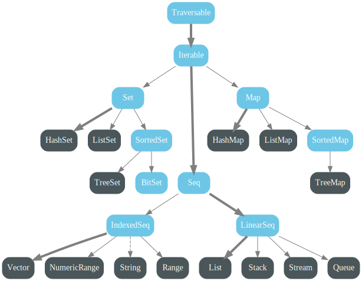
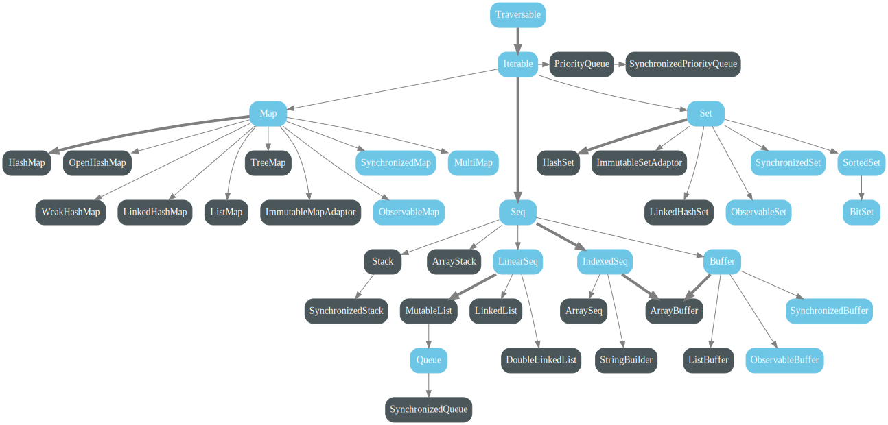

# Systèmes multi-agents

Ce projet a pour but de mettre en application les principes de Programmation Fonctionnelle apprises pendant le cours.
Il s'articule autour de 2 applications ScalaFX obligatoires à implémenter:
- simulateur de particules (8 points)
- wator (jeu de la vie avec des requins et des thons) (6 points)

Et une 3e application au choix entre:
- prédateur(s)/proie (6 points)
- application libre (6 points)

Le simulateur de particules et le jeu Wator sont obligatoires, et constituent 14 points sur les 20 du projet.
Les 6 derniers points seront obtenus en implémentant au choix soit l'application prédateur(s)/proie, soit une application avec
un sujet libre.

Chaque application est un système multi-agents. C'est-à-dire l'environnement (la fenêtre) contiendra des agents qui ont
chacun leur propre intelligence et se déplacent en fonction de leur environnement proche (voisinage). Deux types de
voisinages sont en général utilisés:
- Von Neumann (`Nord`, `Sud`, `Est`, `Ouest`)
- Moore (`Nord`, `Sud`, `Est`, `Ouest`, `Nord-Est`, `Nord-Ouest`, `Sud-Est`, `Sud-Ouest`)


:information_source: Nous n'allons considérer que le voisinage de Moore pour implémenter ces applications.

## Applications à implémenter

### Simulateur de particules

Cette application simule des particules qui se déplacent indéfiniment dans l'environnement.

Chaque particule est un cercle défini par:
- son rayon: fixe (le même pour toutes les autres particules)
- sa couleur: aléatoire
- sa position: aléatoire
- sa direction: aléatoire selon le voisinage de Moore

À chaque cycle:
- une particule se déplace dans la prochaine case suivant sa direction
- si elle arrive aux bords de l'environnement, elle réapparaît de l'autre côté
- si elle cogne une autre particule, elle change de direction et prend une autre direction aléatoire

https://github.com/sallareznov/fp-eductive/assets/10208974/3a893e31-3d25-4ec7-9fbd-045d52560bd6

Paramètres utilisés:
```scala
    val numberOfParticles: Int                = 1500
    val particleRadius: Int                   = 3
    val screenBounds: Rectangle2D             = Screen.primary.visualBounds
    val (boardWidth, boardHeight): (Int, Int) = (screenBounds.width.intValue, screenBounds.height.intValue)
```

### Wator

Wator est une simulation de dynamique des populations avec deux types d'espèces: des requins et des thons. Ces
espèces cohabitent dans le même environnement (dans notre cas, l'environnement représenterait l'océan). Les thons se
reproduisent sans contrainte, pendant que les requins essaient de manger les thons.

- `nTunas`: le nombre de thons présents au départ dans l'environnement
- `nSharks`: le nombre de requins présents au départ dans l'environnement

Chaque espèce possède son ensemble de paramètres:

**Pour chaque thon**
- `tBreed`: le nombre de cycles avant qu'un thon puisse se reproduire

**Pour chaque requin**
- `sBreed`: le nombre de cycles avant qu'un requin puisse se reproduire
- `sEnergy`: la barre d'énergie du requin, qui augmente quand il mange un poisson et diminue quand il n'en mange pas

Les règles sont les suivantes pour chaque espèce:

**Pour chaque thon**
- à chaque cycle, il se déplace de façon aléatoire dans une case voisine libre du voisinage de Moore.
- s'il n'y a pas de case libre, il ne bouge pas et il ne se reproduit pas.
- au bout de `tBreed` cycles, il se reproduit en donnant naissance à un nouveau thon dans la case qu'il occupait avant
de se déplacer.

**Pour chaque requin**
- à chaque cycle, il se déplace dans une case voisine occupée par un thon
- sinon, il se déplace dans une case voisine libre
- s'il mange un thon, il regagne un point de `sEnergy`
- s'il n'y a pas de case occupée par un thon ou de case libre, il ne bouge pas et il ne se reproduit pas.
- au bout de `sBreed` cycles, il se reproduit en donnant naissance à un nouveau requin dans la case qu'il occupait avant
    de se déplacer.
- s'il ne mange pas de thon au bout de `sEnergy` cycles, il meurt

[Infos supplémentaires](https://en.wikipedia.org/wiki/Wa-Tor)

[Papier original](https://softology.pro/papers/wator_dewdney.pdf)

[Exemple de simulation](https://www.youtube.com/watch?v=YnYjjbrWNk0&t=30s)

### Prédateur proie

Vous créerez une application avec:
- une proie (que vous contrôlerez avec les mouvements du clavier `haut, bas, gauche, droite`)
- un ou des prédateurs qui auront pour but de vous rattraper en utilisant un algorithme du plus court chemin

Les deux seuls paramètres de l'application seront:
- le nombre de prédateurs (minimum 1)
- la vitesse du jeu

### Projet libre

Ici, c'est vous qui décidez. Vous pouvez coder votre propre application ScalaFX avec un thème libre, tant
que cette application permette de simuler des agents qui se déplacent en fonction d'évènement (le temps ou à
la touche d'un clavier par exemple) et qui réagissent selon leur environnement.

## Principes de la FP en Scala

Il est recommandé d'utiliser (si nécessaire):
- des fonctions pures
- des `case class`
- des fonctions de transformations de données comme `map`, `flatMap`, `filter`, `foldLeft`, `collect`...
- du pattern matching (`match / case`)
- des alias de types (exemple: `type Coordinates = (Int, Int)`)
- des structures de données adaptées au problème (`Map[K, V]`, `List[A]`, `Array[Array[...]]`)
- des types qui permettent de représenter des cas d'erreurs comme `Option`, `Either` et `Try`

Il est INTERDIT d'utiliser:
- de la mutabilité
- le mot-clé `var` (pour déclarer des variables mutables)
- le mot-clé `while` (pour déclarer une boucle)
- des fonctions qui ne renvoient pas de valeurs (= qui retournent `Unit`)


Il est préférable d'utiliser:
- des types du paquetage `scala.collection.immutable` au lieu de ceux du paquetage `scala.collection.mutable`


Types de `scala.collection.immutable`


Types de `scala.collection.mutable`

## Rendu

Un lien vers le repository Github de votre projet, avec un README expliquant comment lancer les différentes applications.
